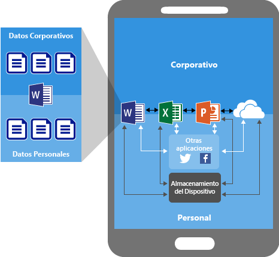
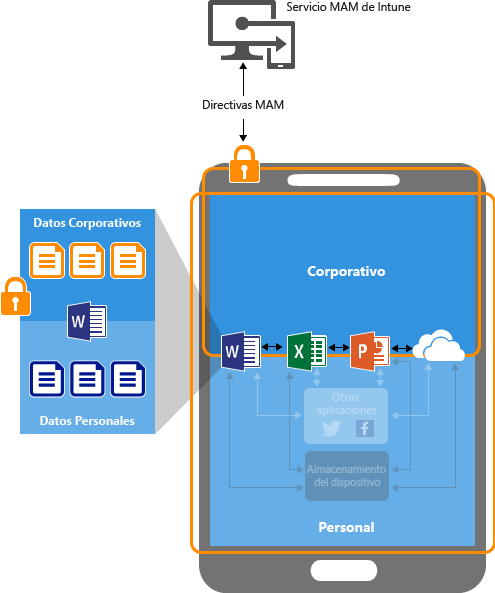
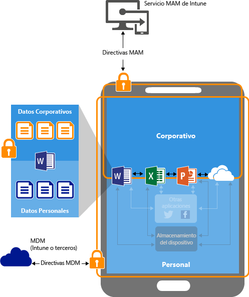

# Configurar directivas de aplicaciones de prevenci&#243;n de p&#233;rdida de datos con Microsoft Intune
Use directivas de administración de aplicaciones móviles en [!INCLUDE[wit_firstref](../Token/wit_firstref_md.md)] para aplicar restricciones a las aplicaciones que ayudan a proteger los datos de su compañía.

**En este tema**

[Cómo puede proteger los datos de la aplicación](#bkmk_protectdata)

[Cómo protegen las directivas MAM los datos de las aplicaciones](#bkmk_howMAMworks)

[Cómo configurar directivas MAM.](#bkmk_WaystoConfigure)

[Pasos siguientes](#bkmk_nextsteps)

### Cómo puede proteger los datos de la aplicación
Los empleados usan dispositivos móviles para tareas personales y de trabajo.  Mientras se asegurar de que los empleados pueden ser productivos, también puede evitar la pérdida de datos, ya sea intencional o involuntaria.  Además, debe tener la posibilidad de proteger los datos de los dispositivos tanto si los administra su empresa como en caso contrario.

Puede usar directivas de administración de aplicaciones móviles (MAM) para ayudar a proteger los datos de su compañía. Dado que esta funcionalidad es **independiente de cualquier solución de administración de dispositivos móviles**, puede usarla para proteger los datos de su empresa con o sin la inscripción de dispositivos en una solución de administración de dispositivos. Simplemente mediante la implementación de **directivas de nivel de aplicación**, puede restringir el acceso a recursos de la compañía y mantener los datos dentro del ámbito de su departamento de TI.

Las directivas MAM admiten los siguientes escenarios:

-   **Dispositivos administrados e inscritos** en [!INCLUDE[wit_nextref](../Token/wit_nextref_md.md)].  Normalmente se trata de dispositivos propiedad de empresas administrados por usted.

    > [!IMPORTANT]
    > Si usa Intune con Administrador de configuración para administrar sus dispositivos iOS y Android, puede crear directivas de administración de aplicaciones móviles para aplicaciones móviles de Office que se conectan a servicios de Office 365. Esto no se admite para las aplicaciones que se conectan a los servicios de Exchange o SharePoint locales.

-   **Dispositivos que se administran e inscriben en una solución de administración de dispositivos móviles de terceros** (denominados **MDM** de aquí en adelante).   Normalmente se trata de dispositivos propiedad de empresas administrados por usted.

    > [!NOTE]
    > Las directivas de administración de la aplicaciones móviles no deben usarse con soluciones de contenedor seguro ni de administración de aplicaciones móviles de terceros.

-   **Dispositivos no administrados**.  Estos suelen ser propiedad de empleados no inscritos o administrados mediante una solución de MDM.

> [!IMPORTANT]
> Hay otras ventajas derivadas del uso de MDM con directivas MAM, y las empresas pueden usar ambas al mismo tiempo. Por ejemplo, un empleado puede usar un teléfono de la compañía, así como una tableta personal.  En este caso, el teléfono de la compañía está inscrito en MDM y protegido por las directivas de MAM y el dispositivo personal está protegido únicamente por las directivas de MAM.

**MDM garantiza que el dispositivo esté protegido**.  Por ejemplo, puede solicitar un PIN para acceder al dispositivo o puede implementar aplicaciones administradas en el dispositivo. También puede implementar aplicaciones en dispositivos a través de la solución MDM para proporcionarle más control sobre la administración de aplicaciones.

**Las directivas MAM garantizan que las protecciones de la capa de aplicaciones estén establecidas**. Por ejemplo, puede solicitar un PIN para abrir una aplicación en un contexto de trabajo, o si se pueden compartidos datos entre aplicaciones, o evitar el almacenamiento de datos de aplicaciones de la compañía en una ubicación de almacenamiento personal.

**Las ventajas principales del uso de directivas MAM son las siguientes:**

-   Protección de datos de su compañía a nivel de aplicación.  Puesto que la administración de aplicaciones móviles no requiere la administración de dispositivos, puede proteger los datos de la empresa en dispositivos administrados y no administrados. La administración de datos se centra en la identidad del usuario, que elimina la necesidad de administrar dispositivos.

-   La productividad del usuario final no se ve afectada y no se aplican las directivas cuando se usa la aplicación en un contexto personal.  Las directivas se aplican solo en un contexto de trabajo, lo cual le ofrece la capacidad de proteger los datos de la compañía sin tocar los datos personales.

### Cómo protegen las directivas MAM los datos de las aplicaciones
En los siguientes diagramas se ilustra cómo funciona MAM para proteger los datos de la compañía de las aplicaciones.

Como se muestra en la **Figura 1**, cuando se usan aplicaciones sin restricciones, se pueden entremezclar los datos de la compañía y personales.  Los datos de la compañía podrían acabar en ubicaciones como el almacenamiento personal o transferidas a aplicaciones fuera de su ámbito, lo cual provocaría una pérdida de datos. En el diagrama siguiente se muestra el estado sin restricciones. Las flechas muestran el movimiento de datos entre aplicaciones (personales y corporativas) y a ubicaciones de almacenamiento.

En la Figura 2 se representa el mismo entorno, pero con las directivas establecidas restringiendo el uso compartido de datos.  Con las directivas de protección de datos, puede configurar directivas que evitan que los datos de la compañía se guarden en el almacenamiento local del dispositivo o se muevan entre las aplicaciones no protegidas por las directivas de protección de datos. Estas directivas le permiten establecer varias directivas de acceso y reubicación de datos que ayudan a proteger los datos de la empresa. Sin embargo, las directivas no surtirán efecto cuando el usuario final use la aplicación para hacer trabajos personales, ya que las restricciones solo se ven en el contexto de trabajo.  Esto permite al usuario final del dispositivo usar la aplicación para tareas personales y de trabajo. Esto recibe el nombre de compatibilidad con varias identidades.

**Varias identidades:**

Varias identidades le ofrece la capacidad de usar diferentes cuentas (de trabajo y personal) para tener acceso a las mismas aplicaciones.  En los dispositivos en los que se usan las aplicaciones para tareas personales y de trabajo, puede aplicar la directiva cuando el usuario final está usando la aplicación con su cuenta de trabajo, pero no cuando la están usando con su cuenta personal.[!INCLUDE[wit_nextref](../Token/wit_nextref_md.md)] Las directivas MAM hacer exactamente eso.  Las restricciones se aplican solo cuando el usuario inicia sesión en una aplicación usando la cuenta de trabajo. Cuando el usuario inicia sesión en la misma aplicación con su cuenta personal, no se aplica la configuración de directiva y el usuario tiene libertad para mover datos sin restricciones.

Todas las aplicaciones móviles de Office admiten varias identidades.

Lea el tema [Experiencia del usuario final para aplicaciones asociadas con directivas de administración de aplicaciones móviles de Microsoft Intune](../Topic/End-user-experience-for-apps-associated-with-Microsoft-Intune-mobile-app-management-policies.md) para comprender cómo afectan las directivas MAM a la experiencia del usuario final.

**Dispositivos administrados por una solución MDM**

**Para dispositivos inscritos en una solución MDM**-

La solución MDM:

-   Inscribe el dispositivo.

-   Implementa las aplicaciones en el dispositivo

-   Proporciona administración y conformidad continua de los dispositivos

**Las directivas MAM agregan valor de los siguientes modos:**

-   Ayudando a evitar la fuga de datos de la compañía a aplicaciones y servicios de consumidor

-   Aplicando restricciones (Guardar como, Portapapeles, PIN, etc.) a aplicaciones móviles

-   Borrar datos de compañía de las aplicaciones sin borrar esas aplicaciones del dispositivo

En la Figura 3 se muestran las capas de protección que ofrecen las directivas MDM y MAM.

**Dispositivos BYOD no administrados**

En los dispositivos BYOD no inscritos en ninguna solución MDM, las directivas MAM pueden ayudar a proteger los datos de la compañía a nivel de aplicación. Existen algunas limitaciones a tener en cuenta, por ejemplo:

-   No se puede implementar aplicaciones en el dispositivo.  El usuario final debe obtener las aplicaciones de la tienda.

-   No se puede proporcionar perfiles de certificados en estos dispositivos.

-   No se puede proporcionar configuraciones de Wi-Fi y VPN de compañía en estos dispositivos.

En la Figura 4 se muestra cómo funcionan las directivas de protección de datos a nivel de aplicación sin MDM.

### Cómo configurar directivas MAM.
Puede configurar directivas MAM de las dos maneras siguientes:

1.  Puede usar el **portal de vista previa de Azure** para configurar directivas e implementarlas en los usuarios.  Puede usar este portal para configurar directivas en tres escenarios:

    -   Dispositivos no administrados por ninguna solución de administración de dispositivos móviles.

    -   Dispositivos inscritos en [!INCLUDE[wit_nextref](../Token/wit_nextref_md.md)] o en un MDM de terceros. Puede crear directivas MAM e implementar las aplicaciones en los usuarios de este portal. Los usuarios finales tendrán que descargar las aplicaciones de la tienda de Apple o de Google Play.  Si desea implementar aplicaciones en dispositivos con las directivas MAM, use la **consola de administración de Intune**. Consulte [Proteger datos mediante las directivas de administración de aplicaciones móviles con Microsoft Intune](../Topic/Configure-and-deploy-mobile-application-management-policies-in-the-Microsoft-Intune-console.md) para obtener más detalles.

        > [!IMPORTANT]
        > Si usa Intune con Administrador de configuración para administrar sus dispositivos iOS y Android, puede crear directivas de administración de aplicaciones móviles para aplicaciones móviles de Office que se conectan a servicios de Office 365.  Esto no se admite para las aplicaciones que se conectan a los servicios de Exchange o SharePoint locales.

    Lea la [Introducción a las directivas de administración de aplicaciones móviles en el portal de Azure](../Topic/Get-started-with-mobile-app-management-policies-in-the-Azure-portal.md) para obtener más detalles sobre cómo usar el portal de vista previa de Azure.

2.  La consola de administración de [!INCLUDE[wit_nextref](../Token/wit_nextref_md.md)] solo admite la configuración de directivas MAM para los dispositivos que están inscritos en [!INCLUDE[wit_nextref](../Token/wit_nextref_md.md)].

    Descubra cómo [Proteger datos mediante las directivas de administración de aplicaciones móviles con Microsoft Intune](../Topic/Configure-and-deploy-mobile-application-management-policies-in-the-Microsoft-Intune-console.md).

### Pasos siguientes
[Introducción a las directivas de administración de aplicaciones móviles en el portal de Azure](../Topic/Get-started-with-mobile-app-management-policies-in-the-Azure-portal.md)

[Crear e implementar directivas de administración de aplicaciones móviles con Microsoft Intune](../Topic/Create-and-deploy-mobile-app-management-policies-with-Microsoft-Intune.md)

## Vea también
[Configure apps](../Topic/Configure-apps.md)
[Implementar y configurar aplicaciones con Microsoft Intune](../Topic/Deploy-and-configure-apps-with-Microsoft-Intune.md)

