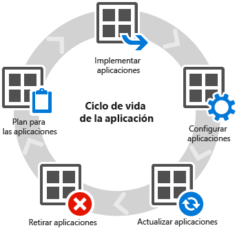

# Implementar y configurar aplicaciones con Microsoft Intune

Uno de los principales objetivos por los que muchas empresas usan [!INCLUDE[wit_firstref](../Token/wit_firstref_md.md)] es para implementar las aplicaciones que los usuarios necesitan para realizar su trabajo. Antes de implementar las aplicaciones, deberá [administrar los dispositivos](https://technet.microsoft.com/library/dn646962.aspx).

Por ejemplo, si la empresa usa Microsoft Word, hay versiones disponibles para Windows, iOS, Android y otros. El desafío al que se enfrenta como administrador de TI consiste en administrar la gran cantidad de aplicaciones disponibles en muchos dispositivos diferentes y plataformas informáticas, de forma que los usuarios puedan hacer su trabajo y se garantice, a la vez, la seguridad de los datos de la empresa.

Además, [!INCLUDE[wit_nextref](../Token/wit_nextref_md.md)] ofrece diversas opciones que ayudan a administrar la seguridad y las características de la aplicación, incluidas las directivas de administración de aplicaciones móviles que permiten administrar las aplicaciones en dispositivos que no están inscritos en [!INCLUDE[wit_nextref](../Token/wit_nextref_md.md)] o que se administran mediante otra solución.

## Comprender el ciclo de vida de la aplicación
Igual que con la administración de los dispositivos, las aplicaciones tienen un ciclo de vida que parte de la preparación y pasa por la implementación, supervisión, actualización y retirada.[!INCLUDE[wit_nextref](../Token/wit_nextref_md.md)] puede ayudarle en todas las fases de este ciclo de vida:

### Plan
En el tema [Introducción a la implementación de aplicaciones en Microsoft Intune](../Topic/Plan-for-app-deployment-in-Microsoft-Intune.md), obtendrá información sobre algunos de los requisitos previos y conceptos que debe conocer antes de empezar a trabajar con las aplicaciones, se familiarizará con el área de trabajo **Aplicaciones** y obtendrá información sobre los diferentes tipos de aplicación que puede implementar.

[!INCLUDE[wit_nextref](../Token/wit_nextref_md.md)] también ofrece herramientas para [examinar qué aplicaciones ya están en uso](https://technet.microsoft.com/en-us/library/jj733634.aspx) en su organización y saber dónde están instaladas.

[!INCLUDE[wit_nextref](../Token/wit_nextref_md.md)] admite la [instalación de una gama de aplicaciones diferentes](https://technet.microsoft.com/en-us/library/dn646955.aspx), incluidas las aplicaciones de la tienda de aplicaciones, aplicaciones web y aplicaciones escritas internamente.

### Implementar
Una vez que comprenda los conceptos básicos, puede iniciar la implementación de aplicaciones. En estas secciones encontrará todo lo que necesita saber para preparar las aplicaciones para la implementación y, posteriormente, implementarlas en [dispositivos móviles](https://technet.microsoft.com/library/dn646972.aspx) y [equipos](https://technet.microsoft.com/library/dn646961.aspx).

### Configurar
[!INCLUDE[wit_nextref](../Token/wit_nextref_md.md)] ofrece herramientas que ayudan a administrar, configurar y proteger los datos de la empresa en sus aplicaciones.

-   Directivas de configuración de aplicaciones móviles para ofrecer opciones de configuración a una aplicación cuando se ejecuta. Por ejemplo, puede especificar el idioma, la seguridad o la configuración de red de la aplicación.

-   Las directivas de administración de aplicaciones móviles ayudan a proteger los datos de aplicación de la empresa al restringir la funcionalidad que transfiere datos entre las aplicaciones. Por ejemplo, puede restringir las operaciones de cortar, copiar y pegar en una aplicación administrada.

-   Las directivas de explorador administrado configuran una lista de permitidos o una lista de bloqueados que restringe los sitios web que pueden visitar los usuarios del explorador administrado [!INCLUDE[wit_nextref](../Token/wit_nextref_md.md)].

Consulte [Configurar aplicaciones con Microsoft Intune](../Topic/Configure-apps-with-Microsoft-Intune.md).

### Actualizar
Las aplicaciones modernas suelen actualizarse periódicamente. Puede ser una tarea difícil asegurarse de que todos los usuarios ejecuten la versión más reciente de una aplicación. Afortunadamente, [!INCLUDE[wit_nextref](../Token/wit_nextref_md.md)] proporciona una capacidad sencilla que le permite actualizar una aplicación implementada anteriormente a una versión más reciente de la misma aplicación.

Consulte [Actualizar aplicaciones con Microsoft Intune](../Topic/Update-apps-using-Microsoft-Intune.md).

## Retirar
Después de un tiempo, es probable que algunas de las aplicaciones implementadas en los dispositivos ya no sean necesarias y quiera desinstalarlas.[!INCLUDE[wit_nextref](../Token/wit_nextref_md.md)] simplifica este proceso para las aplicaciones que administra.

Consulte [Retirar aplicaciones mediante Microsoft Intune](../Topic/Retire-apps-using-Microsoft-Intune.md).

## Vea también
[Acceso seguro a los recursos de la empresa desde cualquier lugar y en cualquier dispositivo](https://technet.microsoft.com/en-us/library/dn550982.aspx)
[Documentación de Microsoft Intune](../Topic/Documentation-for-Microsoft-Intune.md)

