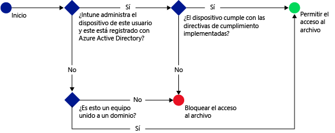

# Administrar el acceso a SharePoint Online con Microsoft Intune
Use la directiva de acceso condicional de [!INCLUDE[wit_firstref](../Token/wit_firstref_md.md)] **SharePoint Online** para administrar el acceso a los archivos de OneDrive para la Empresa que se encuentran en SharePoint Online, en función de las condiciones que especifique.

Cuando un usuario determinado intenta conectarse a un archivo con una aplicación compatible como OneDrive en su dispositivo, se produce la siguiente evaluación:

Para conectarse a los archivos requeridos, el dispositivo que ejecuta OneDrive debe:

-   Estar inscrito con [!INCLUDE[wit_nextref](../Token/wit_nextref_md.md)] o un equipo PC unido a un dominio.

-   Estar registrado en Azure Active Directory, lo que se lleva a cabo automáticamente si el dispositivo está inscrito con [!INCLUDE[wit_nextref](../Token/wit_nextref_md.md)].

    Para equipos unidos a un dominio, debe configurarlos para [registrarse automáticamente](https://msdn.microsoft.com/en-us/library/azure/dn935033.aspx) con Azure Active Directory.

-   Cumplir todas las directivas de cumplimiento de [!INCLUDE[wit_nextref](../Token/wit_nextref_md.md)] implementadas.

El estado del dispositivo se almacena en Azure Active Directory, que concede o bloquea el acceso a los archivos según las condiciones especificadas.

Si no se cumple una condición, se presentará al usuario uno de los mensajes siguientes cuando inicie sesión:

-   Si el dispositivo no está inscrito con [!INCLUDE[wit_nextref](../Token/wit_nextref_md.md)], o registrado en Azure Active Directory, se muestra un mensaje con instrucciones sobre cómo instalar la aplicación de portal de empresa e inscribirse.

-   Si el dispositivo no es conforme, se muestra un mensaje que dirige al usuario al portal web de [!INCLUDE[wit_nextref](../Token/wit_nextref_md.md)], donde puede encontrar información sobre el problema y sobre cómo resolverlo.

-   Para un equipo PC:

    -   Si se establece la directiva para requerir unión a un dominio y el equipo no está unido a ningún dominio, se muestra un mensaje para ponerse en contacto con el administrador de TI.

    -   Si se establece la directiva para requerir unión a un dominio o ser conforme y el equipo no cumple con estos requisitos, se muestra un mensaje con instrucciones sobre cómo instalar la aplicación del portal de empresa e inscribirse.

Puede controlar el acceso a SharePoint Online desde las siguientes aplicaciones:

-   Microsoft Office Mobile (Android)

-   Microsoft OneDrive (Android e iOS)

-   Microsoft Word (Android e iOS)

-   Microsoft Excel (Android e iOS)

-   Microsoft PowerPoint (Android e iOS)

-   Microsoft OneNote (Android e iOS)

## Pasos para configurar el acceso condicional de SharePoint Online

### Paso 1: Configurar grupos de seguridad de Active Directory
Antes de empezar, configure los grupos de seguridad de Azure Active Directory para la directiva de acceso condicional. Estos grupos se pueden configurar en el **Centro de administración de Office 365** o el **portal de cuentas de Intune**. Estos grupos contienen los usuarios de destino o exentos de la directiva. Cuando un usuario es destinatario de una directiva, cada dispositivo que use debe ser conforme con el fin de obtener acceso a los recursos.

Se pueden especificar dos tipos de grupo en una directiva de SharePoint Online:

-   **Grupos destinatarios**: contiene grupos de usuarios a los que se aplicará la directiva

-   **Grupos exentos**: contiene grupos de usuarios que están exentos de la directiva (opcional)

Si un usuario pertenece a ambos grupos, estará exento de la directiva.

### Paso 2: Configurar e implementar una directiva de cumplimiento
Asegúrese de que crea e implementa una directiva de cumplimiento para todos los dispositivos a los que se destinará la directiva de SharePoint Online.

> [!NOTE]
> Mientras se implementan las directivas de cumplimiento en los grupos de [!INCLUDE[wit_nextref](../Token/wit_nextref_md.md)], las directivas de acceso condicional se destinan a grupos de seguridad de Azure Active Directory.

Para obtener más información sobre cómo configurar la directiva de cumplimiento, consulte [Administrar directivas de cumplimiento del dispositivo de Microsoft Intune](../Topic/Manage-device-compliance-policies-for-Microsoft-Intune.md).

> [!IMPORTANT]
> Si no ha implementado una directiva de cumplimiento y luego habilita la directiva de SharePoint Online, se concederá acceso a todos los dispositivos a los que se dirija la directiva.

Cuando esté listo, continúe con el **paso 3**.

### Paso 3: Configurar la directiva de SharePoint Online
A continuación, configure la directiva para requerir que solo los dispositivos administrados y conformes puedan tener acceso a SharePoint Online. Esta directiva se almacenará en Azure Active Directory.

#### 

1.  En la [Consola de administración de Microsoft Intune](https://manage.microsoft.com), haga clic en **Directiva** &gt; **Acceso condicional** &gt; **Directiva de SharePoint Online**.

2.  Seleccione **Habilitar directiva de acceso condicional para SharePoint Online**.

3.  En **Plataformas de dispositivos**, puede elegir aplicar la directiva de acceso condicional para:

    -   **Todas las plataformas**

        Esto requerirá inscribir cualquier dispositivo usado para tener acceso a **SharePoint Online** en Itune y que sea compatible con las directivas.  Cualquier aplicación cliente que use la **autenticación moderna** está sujeta a la directiva de acceso condicional y si la plataforma no es compatible actualmente con Intune, el acceso a **SharePoint Online** se bloqueará.

    -   **Plataformas específicas**

        Si elige la opción **Plataformas específicas**, verá una lista de plataformas que puede seleccionar individualmente.   La directiva de acceso condicional se aplicará a cualquier aplicación cliente que use la autenticación moderna, pero solo en las plataformas que seleccione.

    > [!TIP]
    > **Autenticación moderna** proporciona el inicio de sesión basado en Active Directory Authentication Library (ADAL) a los clientes de Office.
    > 
    > -   La autenticación basada en ADAL permite a los clientes de Office realizar la autenticación basada en explorador (también conocida como autenticación pasiva).  Para realizar la autenticación, se envía al usuario a una página web de inicio de sesión.
    > -   Este nuevo método de inicio de sesión permite nuevos escenarios, como el acceso condicional, según el **cumplimiento de los dispositivos** y si se realizó la **autenticación multifactor**.
    > 
    > Este [artículo](https://blogs.office.com/2014/11/12/office-2013-updated-authentication-enabling-multi-factor-authentication-saml-identity-providers/) contiene información más detallada sobre cómo funciona la autenticación moderna.

    Para los equipos con Windows, el equipo debe estar unido a un dominio o inscrito con [!INCLUDE[wit_nextref](../Token/wit_nextref_md.md)] y ser conforme. Puede establecer los requisitos siguientes:

    -   **Los dispositivos deben estar unidos a un dominio o ser conformes.** Esto significa que los equipos deben estar unidos a un dominio o cumplir con las directivas establecidas en [!INCLUDE[wit_nextref](../Token/wit_nextref_md.md)]. Si el equipo no cumple con alguno de estos requisitos, se le solicita al usuario que inscriba el dispositivo con [!INCLUDE[wit_nextref](../Token/wit_nextref_md.md)].

    -   **Los dispositivos deben estar unidos a un dominio.** Esto significa que los equipos deben estar unidos a un dominio para tener acceso a Exchange Online. Si el equipo no está unido a un dominio, el acceso al correo electrónico se bloquea y el usuario debe ponerse en contacto con el administrador de TI.

    -   **Los dispositivos deben ser conformes.** Esto significa que los equipos deben inscribirse en [!INCLUDE[wit_nextref](../Token/wit_nextref_md.md)] y ser conformes. Si el equipo no está inscrito, se muestra un mensaje con instrucciones sobre cómo inscribirse.

4.  En **Grupos de destino**, haga clic en **Modificar** para seleccionar los grupos de seguridad de Azure Active Directory a los que se aplicará la directiva. Puede elegir dirigir esto a todos los usuarios o solo a un selecto grupo de usuarios.

5.  En **Grupos exentos**, opcionalmente, haga clic en **Modificar** para seleccionar los grupos de seguridad de Azure Active Directory que se van a excluir de la directiva.

6.  Cuando haya terminado, haga clic en **Guardar**.

No es necesario implementar la directiva de acceso condicional, ya que surte efecto inmediatamente.

### Paso 4: Supervisar el cumplimiento y las directivas de acceso condicional
En el área de trabajo **Grupos**, puede ver el estado de acceso condicional de los dispositivos.

Seleccione cualquier grupo de dispositivos móviles y, a continuación, en la pestaña **Dispositivos**, seleccione uno de los siguientes **Filtros**:

-   **Dispositivos no registrados en AAD**: estos dispositivos están bloqueados en SharePoint Online.

-   **Dispositivos no conformes**: estos dispositivos están bloqueados en SharePoint Online.

-   **Dispositivos registrados en AAD y conformes**: estos dispositivos pueden tener acceso a SharePoint Online.

## Vea también
[Administrar el acceso al correo electrónico y SharePoint con Microsoft Intune](../Topic/Manage-access-to-email-and-SharePoint-with-Microsoft-Intune.md)

